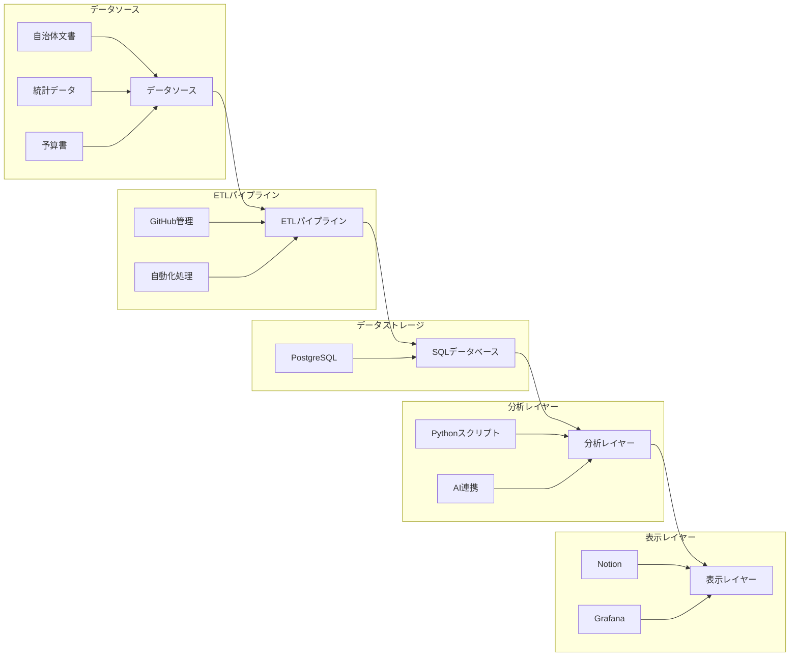

# システムアーキテクチャ概要

## 1. 全体構成

本システムは、富山県自治体データの分析基盤として、以下のツールを統合的に活用します：

- Notion: ドキュメント管理・チームコラボレーション
- GitHub: コード管理・自動化
- PostgreSQL: データストレージ
- Grafana: データ可視化

## 2. 各レイヤーの役割

### 2.1 データソースレイヤー
- 自治体文書（PDF、Word等）
- 統計データ（CSV、Excel等）
- 予算書データ
- Webスクレイピングデータ

### 2.2 ETLパイプライン（GitHub管理）
- データ取り込み処理
- 前処理・クレンジング
- 構造化データ変換
- 自動化（GitHub Actions）

### 2.3 データストレージ（PostgreSQL）
- リレーショナルデータベース
- 全文検索機能
- 時系列データ最適化
- バックアップ・リストア

### 2.4 分析レイヤー
- Python/Rによる統計分析
- 機械学習モデル
- 自然言語処理
- AI連携（ChatGPT/Copilot）

### 2.5 表示レイヤー
- Notion: ドキュメント・プロジェクト管理
- Grafana: データ可視化・ダッシュボード

## 3. システムの特徴

### 3.1 拡張性
- モジュラー設計による機能追加の容易さ
- 新しいデータソースの追加が容易
- 分析手法の柔軟な拡張

### 3.2 自動化
- データ取り込みの自動化
- 定期的な分析の実行
- レポート生成の自動化

### 3.3 セキュリティ
- アクセス制御
- データ暗号化
- 監査ログ

### 3.4 可用性
- バックアップ・リストア
- エラー検知
- 監視体制

## 4. 段階的実装計画

### フェーズ1（基礎構築）
- NotionとGitHubの連携確立
- 基本的なデータ分析環境の構築
- 初期ドキュメント作成

### フェーズ2（データ構造化）
- PostgreSQLデータベース導入
- 基本ETLパイプライン構築
- 自動化プロセスの確立

### フェーズ3（可視化強化）
- Grafanaダッシュボード構築
- Notionとの連携強化
- 分析レポート自動生成

### フェーズ4（AI統合・高度化）
- AI分析機能の実装
- 高度な予測モデルの導入
- システム全体の最適化
