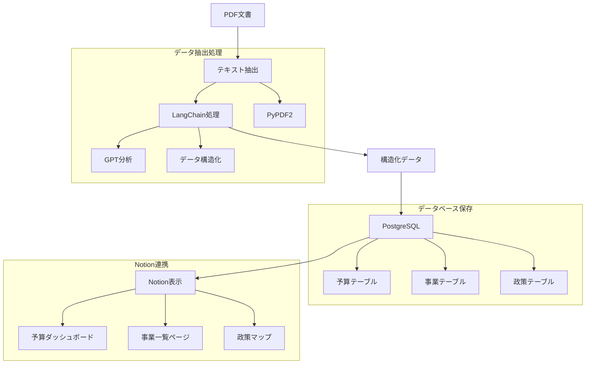

# 富山県自治体データ分析システム 実装仕様書

## 1. システム概要

### 1.1 データフロー


### 1.2 コンポーネント構成

#### 1.2.1 データ抽出層
| コンポーネント | 説明 | 技術要素 |
|--------------|------|---------|
| PDF処理 | 文書からのテキスト抽出 | PyPDF2, pdf2text |
| テキスト解析 | 構造化データ抽出 | LangChain, OpenAI API |
| データ変換 | 抽出データの正規化 | Python, pandas |

#### 1.2.2 データ永続化層
| コンポーネント | 説明 | 技術要素 |
|--------------|------|---------|
| データベース | 構造化データの保存 | PostgreSQL 14+ |
| データ同期 | Notion連携処理 | Python, Notion API |

#### 1.2.3 表示層
| コンポーネント | 説明 | 技術要素 |
|--------------|------|---------|
| Notionページ | データ閲覧・編集 | Notion Database |
| ダッシュボード | データ可視化 | Notion, Charts |

## 2. 実装詳細

### 2.1 データ抽出処理

#### 2.1.1 PDFテキスト抽出
```python
from pypdf import PdfReader
import os

def extract_text_from_pdf(pdf_path):
    reader = PdfReader(pdf_path)
    text = ""
    for page in reader.pages:
        text += page.extract_text()
    return text
```

#### 2.1.2 LangChain処理
```python
from langchain.llms import OpenAI
from langchain.prompts import PromptTemplate

# プロンプトテンプレート
BUDGET_EXTRACT_TEMPLATE = """
以下の予算文書から次の情報を抽出してJSON形式で出力してください：
1. 事業名
2. 予算額
3. 施策分野
4. 事業概要
5. KPI/目標値

文書：
{text}
"""

def extract_budget_data(text):
    llm = OpenAI(temperature=0)
    prompt = PromptTemplate(
        input_variables=["text"],
        template=BUDGET_EXTRACT_TEMPLATE
    )
    chain = LLMChain(llm=llm, prompt=prompt)
    return chain.run(text=text)
```

### 2.2 データベース設計

#### 2.2.1 テーブル構造
```sql
-- 事業テーブル追加
CREATE TABLE projects (
    id SERIAL PRIMARY KEY,
    name VARCHAR(200) NOT NULL,
    description TEXT,
    start_date DATE,
    end_date DATE,
    budget_amount BIGINT,
    kpi_json JSONB,
    municipality_id INTEGER REFERENCES municipalities(id),
    policy_area_id INTEGER REFERENCES policy_areas(id),
    created_at TIMESTAMP DEFAULT CURRENT_TIMESTAMP,
    updated_at TIMESTAMP DEFAULT CURRENT_TIMESTAMP
);

-- KPI履歴テーブル
CREATE TABLE kpi_history (
    id SERIAL PRIMARY KEY,
    project_id INTEGER REFERENCES projects(id),
    metric_name VARCHAR(100),
    metric_value NUMERIC,
    target_value NUMERIC,
    measured_date DATE,
    created_at TIMESTAMP DEFAULT CURRENT_TIMESTAMP
);
```

### 2.3 Notion連携

#### 2.3.1 データベースビュー
```sql
CREATE VIEW notion_project_view AS
SELECT 
    p.name as "事業名",
    p.description as "事業概要",
    p.budget_amount as "予算額",
    pa.name as "施策分野",
    m.name as "自治体名",
    p.kpi_json as "KPI情報"
FROM projects p
JOIN municipalities m ON p.municipality_id = m.id
JOIN policy_areas pa ON p.policy_area_id = pa.id;
```

#### 2.3.2 Notion同期処理
```python
from notion_client import Client

def sync_to_notion(database_id, data):
    notion = Client(auth=os.environ["NOTION_API_KEY"])
    
    # Notionページ作成/更新
    notion.pages.create(
        parent={"database_id": database_id},
        properties={
            "事業名": {"title": [{"text": {"content": data["name"]}}]},
            "予算額": {"number": data["budget_amount"]},
            "施策分野": {"select": {"name": data["policy_area"]}},
            # その他のプロパティ
        }
    )
```

## 3. 実装フェーズ

### 3.1 フェーズ1：基盤構築
- [x] プロジェクト構造の作成
- [x] 依存関係の定義
- [x] データベーススキーマ設計

### 3.2 フェーズ2：データ抽出基盤
- [ ] PDF処理機能実装
- [ ] LangChain統合
- [ ] データ構造化処理

### 3.3 フェーズ3：Notion連携
- [ ] Notionデータベース設計
- [ ] 同期処理実装
- [ ] 自動更新設定

## 4. コスト見積もり

### 4.1 API利用コスト
- OpenAI API: 約$0.2/文書
- Notion API: 無料枠内で運用可能

### 4.2 インフラコスト
- PostgreSQL: ローカル環境で運用
- バックアップ: ローカルストレージ利用

## 5. 監視とメンテナンス

### 5.1 監視項目
- PDF取り込み状況
- OpenAI API処理状況
- Notion同期状況

### 5.2 バックアップ計画
- データベース: 日次バックアップ
- 設定ファイル: Git管理
- 抽出済みデータ: ローカルストレージ

---

Version: 1.0
作成日: 2025年3月28日
最終更新日: 2025年3月28日
